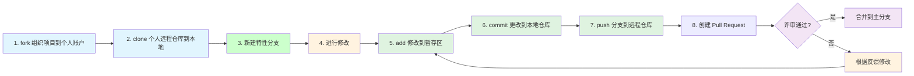
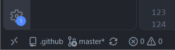
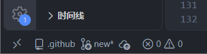
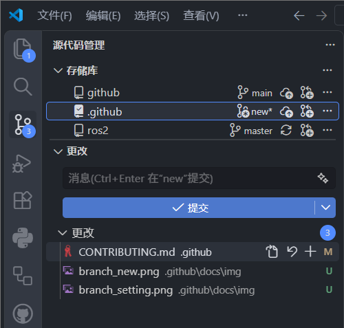
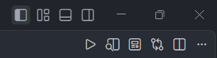
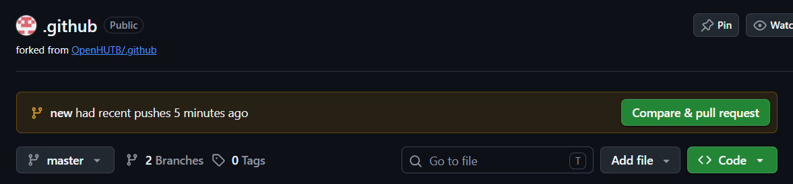
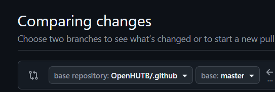

# 贡献指南

开源的核心就是与他人沟通，也就是解决冲突的过程。该指南的初衷就是为初学者提供一个简单的方法去学习以及参与开源项目。


_如果你的电脑上未安装 git 或对命令行不熟悉，请参考以下的 [软件安装](#软件安装)。_ 
[视频教程链接](https://www.bilibili.com/video/BV1udEuzrEa7/?spm_id_from=333.1391.0.0&vd_source=0a56e113c3144b313a6ea829d3996ce9)


## 在cmd/bash提交本地修改的步骤



**1.** [注册](https://openhutb.github.io/.github/dev/sign_up/) 并登陆 Github 账号，在 [想要修改的开源孪创仓库](https://github.com/OpenHUTB/hutb) 页面右上角点击`Fork`，然后点击`Create a new fork`，**创建分叉**到个人仓库。


**2.克隆个人仓库**（若出现SSL certificate problems请关闭加速器再克隆）：
```shell
# 注意：该命令中的 {用户名} 替换为自己的用户名，hutb 替换为想要修改的仓库名，否则没有权限直接修改组织仓库
git clone https://github.com/{用户名}/hutb.git
```


**3.新建特性分支**

在命令行窗口中把目录切换到仓库目录（比如.github）

```bash
cd .github
```
接下来使用 `git switch` 命令新建一个代码分支
```bash
git switch -c <新分支的名称>
```

(新分支的名称一般命名为想要增加的新特性。)

**4.修改仓库的文件**

打开任意文件，更新文件内容，保存修改。然后使用 `git status` 列出被改动的文件（后面步骤都可以使用该命令进行状态查看）。


**5-7**.修改并本地测试没问题后，**提交代码到个人仓库**（参考 git 命令说明）：
```shell
git add README.md
git commit -m "update"
git push origin <新分支的名称>
```
将 `<新分支的名称>` 替换为之前新建的分支名称。

<details>
<summary> <strong>如果在 push（推送）过程中出 error（错误），点击这里</strong> </summary>

- ### Authentication Error
     <pre>remote: Support for password authentication was removed on August 13, 2021. Please use a personal access token instead.
  remote: Please see https://github.blog/2020-12-15-token-authentication-requirements-for-git-operations/ for more information.
  fatal: Authentication failed for 'https://github.com/<your-username>/first-contributions.git/'</pre>
  去 [GitHub 的教程](https://docs.github.com/zh/authentication/connecting-to-github-with-ssh/adding-a-new-ssh-key-to-your-github-account) 学习如何生成新的 SSH 密匙以及配置。

</details>

**8.** 在自己仓库的首页发现有提交领先于湖工商仓库的`main`分支，则点击`Contribute` 创建 [Pull Request](https://zhuanlan.zhihu.com/p/153381521) ，来湖工商仓库**做出贡献**，创建成功后等待管理员审核通过（如果发现个人仓库落后于湖工商仓库则点击`Sync frok`以同步其他人的最新修改）。


不久之后，团队成员便会把你所有的变化合并到这个项目的主分支。更改合并后，你会收到一封电子邮件通知。


## 在VScode提交本地修改的步骤

**1.工具准备**

- 首先按上述步骤创建GitHub账号，这里不多赘述；
- 点击VScode左下角小猫图标登录GitHub账号；
- 在VScode扩展商店安装“GitHub Pull Requests”扩展，它把**git add、git commit、git push**和**git branch**这些命令都变成了点击操作，对新手很友好，强烈建议把Chinese Language Pack for Visual Studio Code这个汉化扩展也装上，安装成功之后重启。

**2.克隆个人仓库**

- 该步骤与第一个方法里的一致，不过多赘述。

**3.新建并更改分支**

- 这一步相当于新建一个副本，在这个副本上面你可以做任何事，且不会损坏、污染主分支。
- 在VScode左下角，也就是图一所示位置，会看到**master**或者**main**的字样，这意味着你现在在主分支，点击他，上方对话框会出现**创建新分支...**，点击他就可以创建新分支，成功后如图二所示，创建了一个名为**new**的分支，并且自动跳转到了这个分支，这时候就可以按需修改了。




**4.暂存修改并提交**

- 存，也就是**git add**操作，可以理解成小存档，**git comit**就相当于大存档，你的每一小块修改都需要暂存，最后一起提交。
- 如图三所示，点击左边第三个**源代码管理**图标，在存储库这一栏可以看到新建的分支和主分支，如果下方的更改一栏是空的，说明你现在所处的分支不对，点击对应分支即可切换。随后点击加号即可暂存成功。
确保保存并暂存所有修改后，在**提交**按钮上方的对话框输入本次的说明，就可以提交了。



**5.本地预览**

- 如下图所示，点击第二行第二个放大镜图标就可以直接预览渲染后的网页效果。



**6.发布Branch**

- 在提交之后，这些修改已经在本地存档完毕了，只需上传，这时点击**发布Branch**按钮，最上方对话框会出现2个选择，**origin**对应你自己的云端仓库，**upstream**对应你fork的原仓库。

- **注：请确保发布分支前已经测试过准确无误**

**7.Pull Requests**

- 发布成功后，回到自己的仓库，会出现一个如图所示提醒，点击绿色按钮。


- 这时会跳转到新页面，在合并仓库前找到下图所示未知，这表示把你的修改合并到原仓库，但为了确保万无一失，强烈建议更改目标仓库为自己的仓库，在自己仓库测试没有问题再向原仓库提出**PR**请求。



- 成功之后，这次向自己仓库发起的**PR**会显示为**open**状态，点击**Merge pull request**，直到其状态变为紫色，这时候再去自己仓库，就会发现修改已经同步上去了。
- 测试完毕没有问题就可以向原仓库发送**PR**请求了。


**注意事项：**

- Pull Request 标题需要概括所修改的内容；
- 尽量少包含二进制文件；
- 不提交程序能够输出的中间文件、结果文件；
- 可以提供少量能够保证程序能够正常运行的示例数据，大的输入数据在 README.md 文件中提供百度网盘或者谷歌网盘的下载链接；


## 其他

1.如果提交 Pull Request 时出现冲突，则参考 [使用 TortoiseGit 解决冲突](./doc/resolve_conflict.md) 或 [在 GitHub 上解决合并冲突](https://docs.github.com/zh/pull-requests/collaborating-with-pull-requests/addressing-merge-conflicts/resolving-a-merge-conflict-on-github) 。

2.同步子模块
```
git submodule update --remote
```

3.本地检查`Pull requests`请求
有人发送`Pull requests`时，可以在 GitHub 上合并之前[测试并验证更改](https://docs.github.com/zh/pull-requests/collaborating-with-pull-requests/reviewing-changes-in-pull-requests/checking-out-pull-requests-locally) 。
```shell
# 拉取Pull Request 的 ID 为 7，并在本地新建分支名为 7 的命令：git fetch origin pull/7/head:7
git fetch origin pull/ID/head:BRANCH_NAME
# 切换到新建的分支
git switch BRANCH_NAME
# 前面拉取后，后面又有新的修改
git pull origin pull/ID/head
```


## 软件安装

- 下载相关[开发工具](https://pan.baidu.com/s/1Is2-VR1z-tMYvmdinsVY_g?pwd=hutb) ，先安装`Git-2.40.0-64-bit.exe`，再安装可视化工具管理 [`TortoiseGit-2.14.0.0-64bit.msi`](https://blog.csdn.net/xwnxwn/article/details/108694863)（可选）。

- [git 命令说明](https://blog.csdn.net/weixin_45682261/article/details/124003706) ；


- 使用其他工具的教程

| <a href="https://git-scm.com/download/win"></a> | <a href="https://visualstudio.microsoft.com/zh-hans/vs/getting-started/"></a> |  <a href="https://visualstudio.microsoft.com/zh-hans/vs/"></a> |  <a href="https://github.com/OpenHUTB/.github/blob/master/doc/pycharm-tutorial.md"></a> |
| :---: | :---: | :---: | :---: |
| [Git Bash](https://github.com/firstcontributions/first-contributions/blob/main/docs/cli-tool-tutorials/translations/Chinese/git-bash-windows-tutorial.zh-cn.md) | [Visual Studio 2022](https://visualstudio.microsoft.com/zh-hans/vs/getting-started/) |  [Visual Studio Code](https://visualstudio.microsoft.com/zh-hans/vs/) | [Pycharm](https://github.com/OpenHUTB/.github/blob/master/doc/pycharm-tutorial.md) |


## 问题

###### 国内访问 github 可能较慢

这里提供 github 加速方案和科学上网的 [链接](https://openhutb.github.io/doc/build_carla/#internet) 。

###### 向 github 上 push 的时候报 403 错误

打开`.git/config`，比如：
```
url = https://github.com/OpenHUTB/bazaar.git
```
将你用户名复制粘贴到github前面再加个@，变成：
```
url = https://OpenHUTB@github.com/OpenHUTB/bazaar.git
```
然后就可以进行授权并继续push。


###### 克隆个人仓库出错
若出现SSL certificate problems请关闭加速器再克隆。

###### git push 报错unexpected disconnect while reading sideband packet

```shell
# 增加缓存至4G
git config --global http.postBuffer 4048576000
```

<!-- 参考 [第一次参与开源项目](https://github.com/firstcontributions/first-contributions/blob/main/docs/translations/README.zh-cn.md) -->


